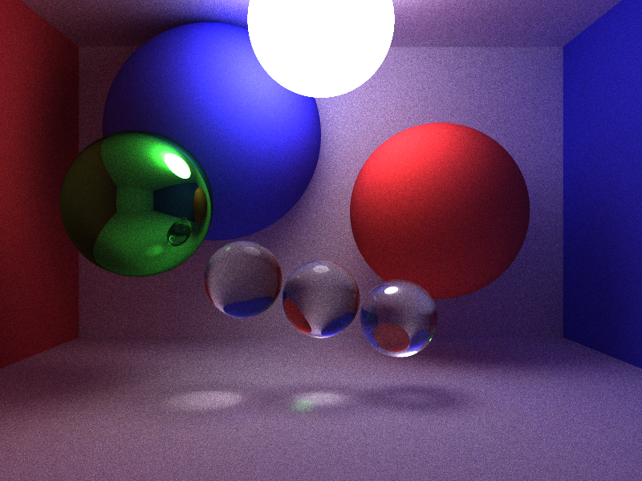

# teeracer

Path tracing renderer in rust.

Shapes:
- [x] Spheres
- [x] Planes
- [x] Triangles
- [x] Prism
- [ ] 3D models

Materials:
- [x] Diffuse (Lambertian model)
- [x] Metal (perfect reflection)
- [x] Dielectrics (e.g. glass)
- [x] Light sources
- [ ] Microfacet BxDFs
- [ ] BxDFs

## Fun things about this implementation

1. The `CanHit` trait

The CanHit trait is how a Ray interacts with objects.
When we impl this trait for Ray, it adds a method that is overloaded with a bunch of different object types.

```rust
impl CanHit<Sphere> for Ray {
    fn shoot_at(&self, Sphere, ...) -> Option<Hit> {
        ...
    }
}
```

We also impl this trait for the `Scene` object which just loops through sub objects! Very flexible!

This makes the main tracing loop pretty elegant:

```rust
for _ in 0..depth {
    match ray.shoot_at(scene, t_min, t_max) {
        Some(hit) => {...}
        None => {...}
    }
}
```

2. Thank rayon and crossbeam for fast parallel rendering!

Path tracing is very parallelizable inherently because each pixel in the image needs to be traced
multiple times.

crossbeam channels enable each worker to send its result to a single receiver listening
on the main thread which sums all the pixels together.

```rust
let (sender, receiver) = channel::unbounded();

// start these workers on another thread so we immediately start listening on the receiver
let t = std::thread::spawn(move || {
    (0..num_rays)
        .into_par_iter()
        .map(|ray_idx| {
            let pixel_idx = ray_idx % num_pixels;
            ...
            let opt_color = T::trace(ray, &scene, depth, &mut rng);
            (pixel_idx, opt_color.unwrap_or(Three::zeros()))
        })
        .for_each_with(sender, |s, x| s.send(x).unwrap());
});

let mut colors = camera.empty_image();
for (pixel_idx, color) in receiver.iter() {
    colors[pixel_idx] += color;
}
```

3. Usage of num_traits::Float allows you to swap precision very easily!

Pretty much every struct has a generic type associated with it to control the precision of the floats to use.
Swapping between f32 and f64 is as easy as specifying one of the generic parameters to render:

```diff
-render::<PathTracer, f32, XorShiftRng>(...)
+render::<PathTracer, f64, XorShiftRng>(...)
```

# Examples

Examples with 1000 samples per pixel:

`cargo run --release --example spheres`:



`cargo run --release --example mirror-prism`:


`cargo run --release --example glass-prism`:


